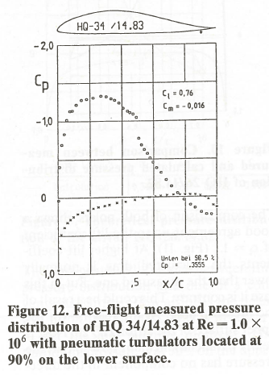
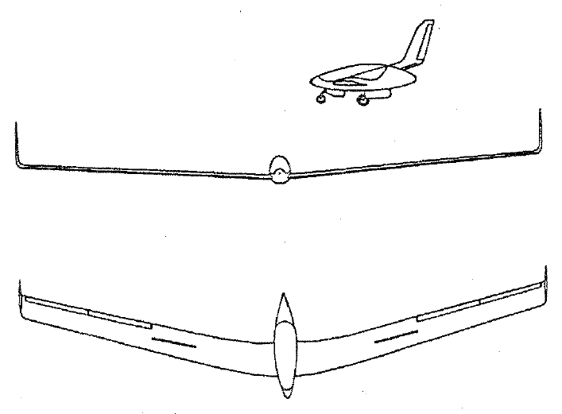

#   Thoughts on tailless aircraft

The following are relevant points to the analysis of tailless planforms.  This information would be of particular relevance when investigating the tailless concept with respect to stability derivatives in a windtunnel.

## The scale effect

Cannot get the similarity required in a small windtunnel.

For practical testing the chord must almost be full size if your eventual goal is a full-scale aircraft.  The scale effect is the reason that tailless aircraft perform very well as models, but perform poorly as full-scale aircraft.  See the graph below from Ref. [1] to understand the drastic difference with respect to just the lift coefficient between model and full scale.  Other stability derivatives have similar differences.

In the 1980's German engineers tried to solve the windtunnel size problem by mounting full size airfoils in fences and flying them on top of sailplanes in the JANUS testbed.

Bearing in mind the scale effect, do not expect to get very accurate results from a small windtunnel model.

## Relevant airfoil sections

Must be low moment coefficients.  Must have high performance and must be laminar flow airfoils.

Some Eppler, NACA23013 and HQ sections from SB-13 are potential candidates.

Links to airfoils in this folder:  TBD.

Two Horstmann Quast (HQ) reflex profiles are shown below from Ref. [2].

Airfoil must be a laminar airfoil section, in other words flow over the top of the airfoil must be laminar for a significant section of chord.

The reason that airfoils for tailless aircraft must be laminar is because sailplanes started using laminar airfoil sections at least from the 1960s.  A laminar airfoil gives such a jump in performance that aircraft with an empennage has better performance compared to a tailless aircraft of similar wing span that does not possess laminar flow sections.

With the work of Horstmann and Quast (late 70s and early 1980s) reflex laminar airfoils became possible and this made the Akaflieg SB-13 possible to potentially rival modern sailplanes in performance.  This is to say if it could achieve acceptable handling qualities and acceptable aeroelastic properties.  Both these points remain significant issues in tailless sailplane design.

The SB-13 from Ref. [3] is shown below:

## Analyse airfoil sections with XFOIL first

Get a good idea of the lift curve slope of the 2D section using XFOIL.  The 3D wing must have a slope less than this, because unless your wing has infinite span, this will be the case and it is a good check for your windtunnel results.

## Planform analysis

Must be performed with XFLR5 or a VLM.

Planform and wing twist should be varied until an elliptical lift distribution is achieved in these linear methods at the cruise condition of the aircraft.

Remember these are linear methods.  They become very unreliable at the onset of stall.  They should only be trusted really up to 8 degrees angle of attack.

But most likely they will give good guidance as to what the aerodynamic performance of the windtunnel model should be between -2 and + 5 degrees angle of attack.

## Windtunnel models

Must be very smooth.  Otherwise the laminar flow has no chance.  Even if it is very smooth, expect to find the flow tripping at swept back angles as a result of crossflow.  Crossflow happens at even moderate sweepback angles.

## Windtunnel balance

With the low forces and moments involved it is highly encouraged that the windtunnel balance be designed around a strain gauge type concept.  This will give very accurate measurement results if used together with an HX-711 or equivalent amplifier that can be used with an Arduino.  Even if strain gauges are expensive, it is better to use them than build something that will not measure accurately or has issues with repeatability.

## The moment curve of a tailless aircraft vs empennage design

This is not as well established yet, but most likely the moment coefficient of a tailless aircraft becomes less negative as it approaches high angles of attack.  In contrast, aircraft with an empennage will tend to have an increasingly negative moment coefficient at stall.  The latter is very stable while the former can lead to tumbling flight which is a very dangerous condition that is difficult to recover from.

Windtunnel results can shed a lot of light on this moment curve as the windtunnel will predict the non-linear behaviour or trends far better than panel methods or VLMs.  Even though the magnitudes might be incorrect, the trend should be very valuable.  Therefore any windtunnel work should extend to the stall to be of significant value.

## References

1.  Modeling flight - The Role of Dynamically Scaled Free-Flight Models in Support of NASA’s Aerospace Programs.  Joseph Chambers
2.  Development of airfoil sections for the swept-back tailless sailplane SB13.  Clemens Shurmeyer and Karl-Heinz Horstmann
3.  A new flying qualities criterion for flying wings.  Wulf Monnich and Lothar Dalldorff.